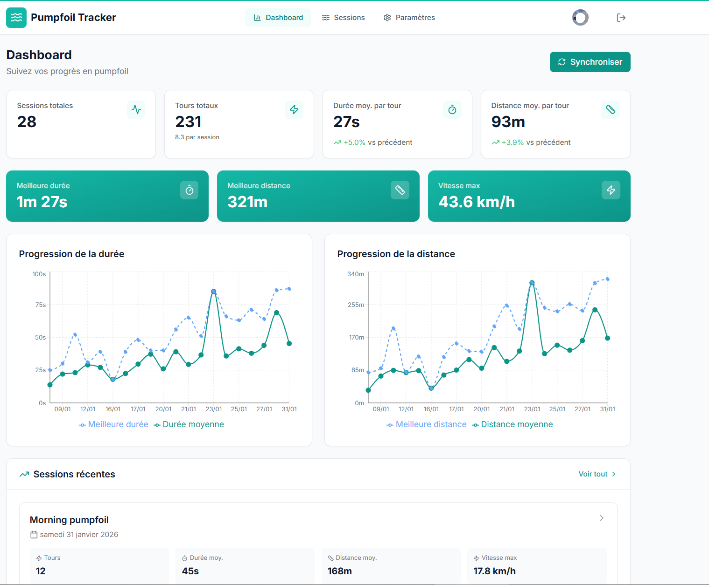
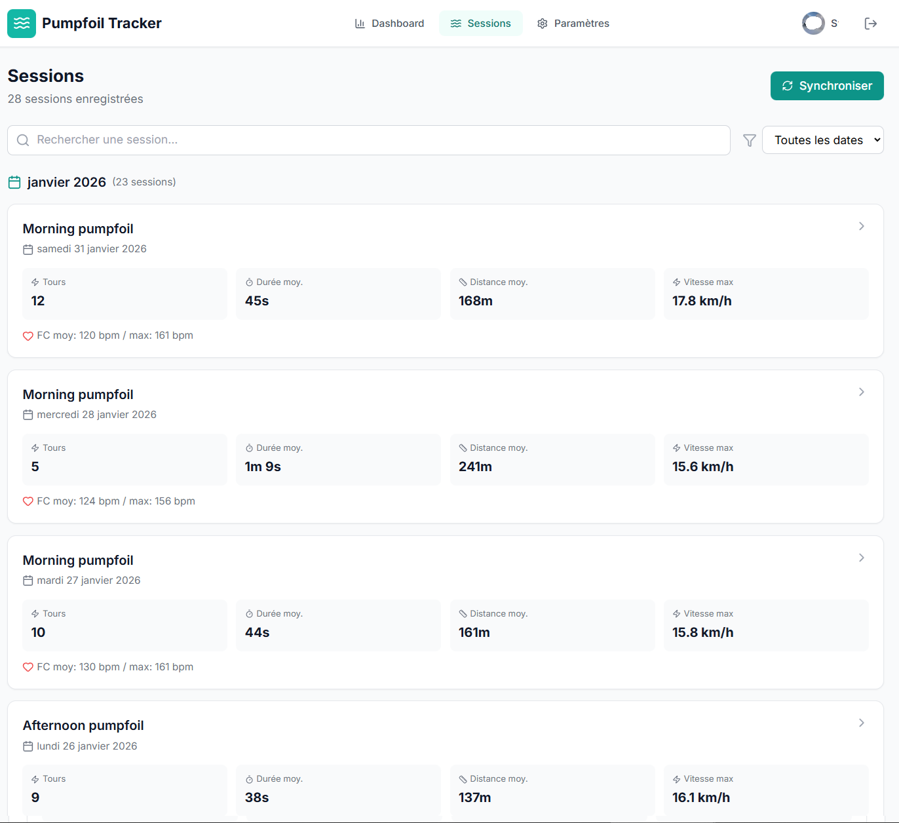
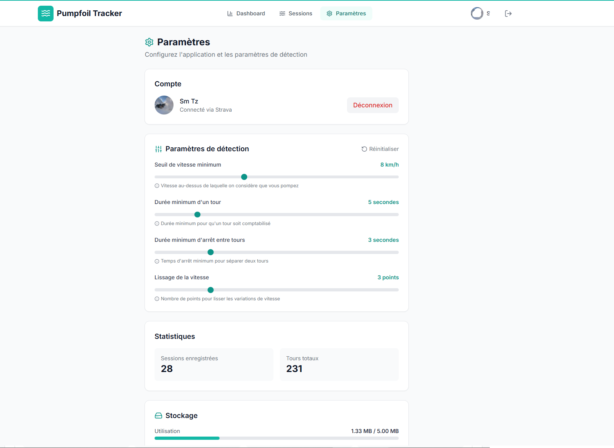

# Pumpfoil Tracker

[](https://opensource.org/licenses/MIT)
[](https://www.typescriptlang.org/)
[](https://reactjs.org/)
[](https://vitejs.dev/)

**Pumpfoil Tracker** est une application web Progressive (PWA) pour suivre et analyser vos sessions de pumpfoil. Elle se connecte à Strava pour importer automatiquement vos activités de pumpfoil (à classer dans la catégorie surf) et détecter vos tours de pump.



## Fonctionnalités

-  **Synchronisation Strava** - Import automatique des activités de type "Surf"
-  **Détection des tours** - Algorithme intelligent qui détecte les phases de pump
-  **Statistiques détaillées** - Durée, distance, vitesse, fréquence cardiaque
-  **Focus sur le meilleur tour** - Analyse détaillée du tour le plus long
-  **PWA** - Installable sur mobile, fonctionne hors-ligne
-  **Paramètres ajustables** - Personnalisez les seuils de détection

## Captures d'écran

| Dashboard | Détail Session | Paramètres |
|-----------|----------------|------------|
|  |  |  |

## Installation

### Prérequis

- Node.js 20.x ou supérieur
- Un compte Strava
- Une application Strava API (voir configuration)

### 1. Cloner le repository

```bash
git clone https://github.com/votre-username/pumpfoil-tracker.git
cd pumpfoil-tracker
```

### 2. Installer les dépendances

```bash
npm install
```

### 3. Configurer Strava API

1. Allez sur [Strava API Settings](https://www.strava.com/settings/api)
2. Créez une nouvelle application :
   - **Application Name**: Pumpfoil Tracker (ou le nom de votre choix)
   - **Category**: Training Analysis
   - **Website**: URL de votre app (ou http://localhost:5173 pour le dev)
   - **Authorization Callback Domain**: localhost (pour le dev) ou votre domaine

3. Copiez le fichier `.env.example` vers `.env` :

```bash
cp .env.example .env
```

4. Remplissez vos identifiants Strava dans `.env` :

```env
VITE_STRAVA_CLIENT_ID=votre_client_id
VITE_STRAVA_CLIENT_SECRET=votre_client_secret
VITE_REDIRECT_URI=http://localhost:5173/callback
```

### 4. Lancer en développement

```bash
npm run dev
```

L'application sera accessible sur http://localhost:5173

## Déploiement

### Build de production

```bash
npm run build
```

Les fichiers de production seront générés dans le dossier `dist/`.

### Déploiement sur un serveur web

1. Uploadez le contenu du dossier `dist/` sur votre serveur web
2. Configurez votre serveur pour rediriger toutes les routes vers `index.html` (SPA)
3. Mettez à jour `VITE_REDIRECT_URI` dans votre `.env` avec votre URL de production
4. Mettez à jour le "Authorization Callback Domain" dans les paramètres de votre app Strava

#### Exemple de configuration Nginx

```nginx
server {
    listen 80;
    server_name pumpfoil.example.com;
    root /var/www/pumpfoil;
    index index.html;

    location / {
        try_files $uri $uri/ /index.html;
    }
}
```

#### Exemple de configuration Apache (.htaccess)

```apache
RewriteEngine On
RewriteBase /
RewriteRule ^index\.html$ - [L]
RewriteCond %{REQUEST_FILENAME} !-f
RewriteCond %{REQUEST_FILENAME} !-d
RewriteRule . /index.html [L]
```

## Configuration des paramètres de détection

L'application permet de personnaliser les paramètres de détection des tours :

| Paramètre | Description | Valeur par défaut |
|-----------|-------------|-------------------|
| Seuil de vitesse minimum | Vitesse au-dessus de laquelle on considère que vous pompez | 8 km/h |
| Durée minimum d'un tour | Durée minimum pour qu'un tour soit comptabilisé | 5 secondes |
| Durée minimum d'arrêt | Temps d'arrêt minimum pour séparer deux tours | 3 secondes |
| Lissage de la vitesse | Nombre de points pour lisser les variations | 3 points |

## Architecture technique

```
src/
├── components/          # Composants React réutilisables
│   ├── charts/         # Graphiques (vitesse, progression)
│   ├── layout/         # Layout principal
│   └── ui/             # Composants UI (cards, boutons, etc.)
├── context/            # Contextes React (Auth, Data)
├── pages/              # Pages de l'application
├── services/           # Services (Strava API, Storage)
├── types/              # Types TypeScript
└── utils/              # Utilitaires (détection des tours)
```

### Technologies utilisées

- **React 18** - UI Framework
- **TypeScript** - Typage statique
- **Vite** - Build tool
- **Tailwind CSS** - Styling
- **Recharts** - Graphiques
- **date-fns** - Manipulation des dates
- **Lucide React** - Icônes
- **Vite PWA** - Progressive Web App

## Compatibilité

- **Montres compatibles** : Garmin Fenix 7, et toute montre connectée à Strava
- **Type d'activité** : L'application importe uniquement les activités de type "Surf" depuis Strava
- **Navigateurs** : Chrome, Firefox, Safari, Edge (versions récentes)

## Contribuer

Les contributions sont les bienvenues ! Voici comment participer :

1. Forkez le repository
2. Créez une branche pour votre fonctionnalité (`git checkout -b feature/ma-fonctionnalite`)
3. Committez vos changements (`git commit -m 'Ajout de ma fonctionnalité'`)
4. Pushez sur la branche (`git push origin feature/ma-fonctionnalite`)
5. Ouvrez une Pull Request

### Guidelines

- Suivez les conventions de code existantes
- Ajoutez des types TypeScript pour tout nouveau code
- Testez vos modifications avant de soumettre

## Roadmap

- [ ] Export des données (CSV, JSON)
- [ ] Comparaison entre sessions
- [ ] Cartes avec tracés GPS
- [ ] Mode sombre
- [ ] Notifications de progression
- [ ] Partage de sessions

## Licence

Ce projet est sous licence MIT. Voir le fichier [LICENSE](LICENSE) pour plus de détails.

---


